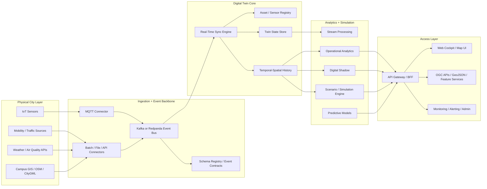

# Architecture

## Status

Current repo now uses **modular monolith** shape:

- interface layer: `api/`
- application/read model layer: `src/unisa_air_twin/application/`
- ingestion layer: `src/unisa_air_twin/ingestion/`
- persistence layer: `src/unisa_air_twin/persistence/`
- infrastructure/persistence adapters: `src/unisa_air_twin/operational_store.py`, `storage.py`, `external_sources.py`
- shared contracts/constants: `src/unisa_air_twin/shared/`

This is right step for current repo size. Full microservices now would add ops cost before domain boundaries stable.

## Current Diagnosis

### Main anti-patterns found

1. **God modules**
   - old `api/main.py`, `live_sensors.py`, `ui_data.py` mixed orchestration, transport, transformation, persistence, and view assembly.
2. **Misleading bounded contexts**
   - `decision_engine.py` is health payload builder, not decision support engine.
   - `model.py` contains heuristics, not simulation engine.
   - `digital_twin_entities.json` is static catalog artifact, not active twin state.
3. **Tight runtime coupling**
   - HTTP routes directly depended on global functions and concrete implementations.
   - ingestion, store refresh, and SSE signaling were wired inline.
4. **Prototype-grade persistence**
   - SQLite works for demo/local ops, not for multi-writer, spatial indexing at scale, lineage, tenant isolation, or long-term temporal analytics.
5. **No real event backbone**
   - MQTT ingestion writes directly into local store.
   - SSE bus is in-memory only, so scale-out replicas would drift.
6. **Weak interoperability posture**
   - GeoJSON present, but no OGC API Features, CityGML/3D Tiles path, schema contracts, or formal event envelopes.
7. **Operational gaps**
   - no authN/authZ
   - no distributed tracing
   - no metrics pipeline
   - no backup/restore automation

### Dead or misleading components

- `app/__pycache__/` artifact: generated noise, not product code.
- `create_digital_twin_entities()` output: useful as context export, but should not be treated as twin core.
- manual rectangular zones: fine for demo, weak for real campus semantics.

## Refactor Done In This Iteration

### Code changes

- split API monolith into:
  - `api/app_factory.py`
  - `api/dependencies.py`
  - `api/routers/health.py`
  - `api/routers/jobs.py`
  - `api/routers/twin.py`
  - `api/routers/frontend.py`
- split ingestion monolith into:
  - `ingestion/catalog.py`
  - `ingestion/normalization.py`
  - `ingestion/snapshots.py`
  - `ingestion/pipeline.py`
  - `ingestion/mqtt.py`
  - `ingestion/runtime.py`
- moved read-model/query logic into `application/twin_query_service.py`
- centralized shared column/schema constants into `shared/constants.py`
- introduced durable operational event log in persistence adapters
- introduced internal projection updater with replay from append-only event log
- introduced optional Redis pub/sub bridge between worker projector and API instances
- introduced versioned event envelope with logical topics and producer metadata
- introduced persisted retry/DLQ policy for projector consumer path
- introduced `EventStreamConsumer` / external bus publisher seam with `store` default backend and optional Kafka adapter
- removed legacy compatibility modules:
  - `src/unisa_air_twin/live_sensors.py`
  - `src/unisa_air_twin/ui_data.py`
- removed obsolete manual snapshot notification endpoint and CLI notify hook
### Architectural benefit

- lower coupling between HTTP transport and core services
- explicit runtime composition for dependency injection and testing
- ingestion responsibilities separated by concern
- write path now split from read-model materialization
- easier path to replace adapters later:
  - SQLite -> Postgres/PostGIS
  - local persistent event log -> Redis/Kafka/NATS without changing producer/consumer contract
  - inline jobs -> worker services

## Current Runtime Topology

Recommended runtime now:

- `api`: FastAPI + SSE stream + Redis subscriber
- `projector`: separate worker that consumes event log and materializes projections
- `redis`: realtime notification bridge
- `web`: React cockpit

This is still modular-monolith domain code, but runtime already moved one step toward event-driven separation.

## Current Modular Structure

```text
api/
  app_factory.py
  autostart.py
  dependencies.py
  events.py
  streaming.py
  routers/
    frontend.py
    health.py
    jobs.py
    twin.py

src/unisa_air_twin/
  application/
    twin_query_service.py
  ingestion/
    catalog.py
    mqtt.py
    normalization.py
    pipeline.py
    runtime.py
    snapshots.py
  persistence/
    base.py
    selector.py
    sqlite_store.py
    postgres_store.py
    migrations/
      001_initial_postgres.sql
  shared/
    constants.py
  analytics.py
  external_sources.py
  gis.py
  operational_store.py
  zones.py
```

## Target Urban Digital Twin Architecture



## Domain Modules To Converge Toward

### `digital_twin_core`

- sensor/asset registry
- twin entity lifecycle
- twin state snapshots
- physical <-> digital synchronization rules
- provenance and confidence metadata

### `data_ingestion`

- MQTT adapters
- REST/file importers
- schema validation
- dead-letter queue
- replay from event log

### `gis_spatial_services`

- campus topology
- zones/POI/buildings/roads
- spatial joins
- OGC API Features
- CityGML / 3D tiles adapters when 3D twin becomes real requirement

### `analytics_engine`

- data quality
- zone aggregation
- anomaly detection
- KPI projections
- operational summaries

### `simulation_engine`

- scenario inputs
- emission/dispersion models
- capacity and mobility what-if runs
- policy comparison

### `realtime_sync`

- event consumption
- state materialization
- projection rebuilds
- websocket/SSE notifications

### `persistence_layer`

- transactional store
- temporal-spatial history
- object storage for raw payloads
- metadata lineage

### `monitoring_observability`

- metrics
- traces
- logs
- audit

## Dependency Rules

1. `api/` may depend on `application/` and contracts, never on storage details beyond defined service seams.
2. `application/` orchestrates use cases and projections; it must not know HTTP.
3. `ingestion/` owns message normalization and snapshot assembly; it should emit domain events in future phase.
4. infrastructure adapters may depend inward; domain/application must not depend outward on concrete deployment tech.
5. twin state must be authoritative in one write model; frontend reads projections only.

## Technology Proposal

### Keep now

- FastAPI
- React/Vite
- MQTT
- GeoJSON
- SSE

### Introduce for production

- **Primary DB:** PostgreSQL + PostGIS
- **Time-series strategy:** TimescaleDB hypertables or native partitioning
- **Event bus:** Kafka or Redpanda
- **Cache / short-lived coordination:** Redis
- **Object storage:** S3-compatible bucket for raw payloads, replay bundles, scenario artifacts
- **Auth:** OIDC provider (Keycloak / Authentik / managed IdP)
- **Observability:** OpenTelemetry + Prometheus + Grafana + Loki
- **Gateway:** Traefik / Kong / Envoy
- **GIS publishing:** pg_tileserv / GeoServer / OGC API Features adapter
- **Async workers:** separate worker process or workflow engine for heavy rebuild/simulation jobs

## Components To Add

- event envelope schema with source, timestamp, geometry, unit, quality, provenance
- twin registry tables for sensors, assets, zones, relations
- command/event audit trail
- scenario run store
- alerting rules and threshold policies
- authN/authZ and RBAC
- health/readiness/liveness split
- backup automation and restore drills
- CI pipeline with lint/test/build/container scan

## Components To Deprecate Or Rename

- rename `decision_engine.py` to operational health or replace with real policy engine
- move `model.py` heuristics behind explicit simulation/prediction boundary
- demote `digital_twin_entities.json` to export artifact, not runtime core source
- replace in-memory snapshot event bus when multiple replicas exist

## Deployment Path

### Phase 1: hardened modular monolith

- one API service
- one worker process
- Postgres/PostGIS
- Redis
- MQTT broker integration
- object storage

Best for first production cut. Simpler ops. Clear domain seams already in code.

### Phase 2: event-driven split

Split only where pressure proves need:

- `ingestion-service`
- `projection-service`
- `analytics-service`
- `simulation-service`
- `api-gateway/bff`

### Phase 3: active twin platform

- bi-directional command path to actuators/control systems
- scenario execution orchestration
- digital shadow + predictive models
- policy engine with explainability and audit

## Evolution Roadmap

1. **Now**
   - finish move from SQLite to Postgres/PostGIS
   - add structured logging, tracing, metrics
   - introduce auth and environment profiles
2. **Near term**
   - emit normalized observation events
   - add Redis/Kafka-backed notification + replay
   - formalize twin registry and state store
3. **Active twin**
   - add command model
   - store twin state transitions
   - support temporal queries and backtesting
4. **Simulation**
   - introduce scenario engine
   - compare observed vs simulated states
   - persist scenario runs and assumptions
5. **Industrial ops**
   - autoscaling workers
   - SLOs and alerts
   - disaster recovery
   - multi-campus / multi-tenant support

## Recommended Next Implementation Steps

1. Replace SQLite operational store with repository interfaces backed by Postgres/PostGIS.
2. Introduce event envelopes and append-only event log for normalized observations.
3. Replace in-memory snapshot bus with Redis pub/sub or Kafka projection trigger.
4. Separate `external_sources.py` into connector adapters per provider.
5. Rename misleading modules (`decision_engine`, `model`) to real bounded-context names.
